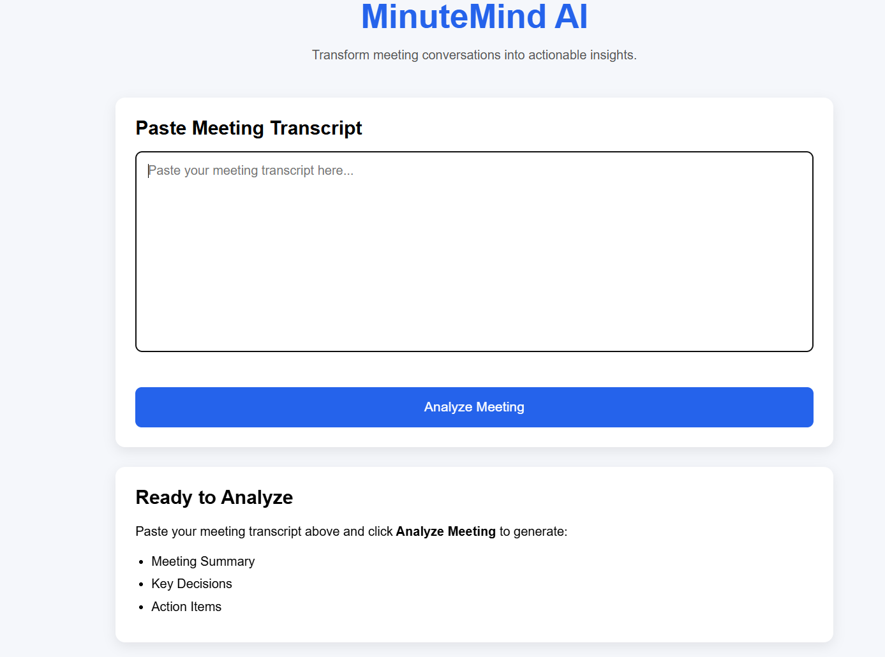
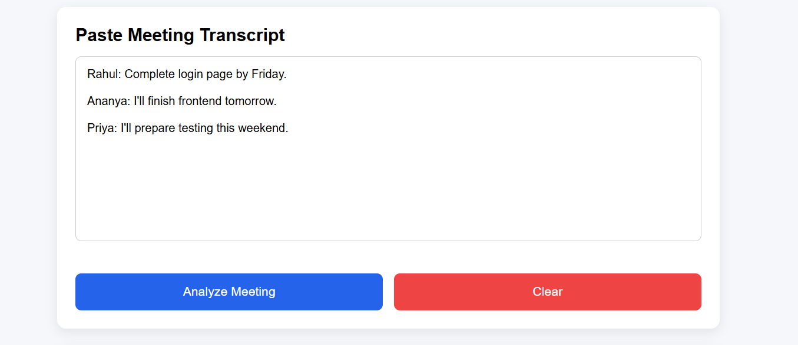
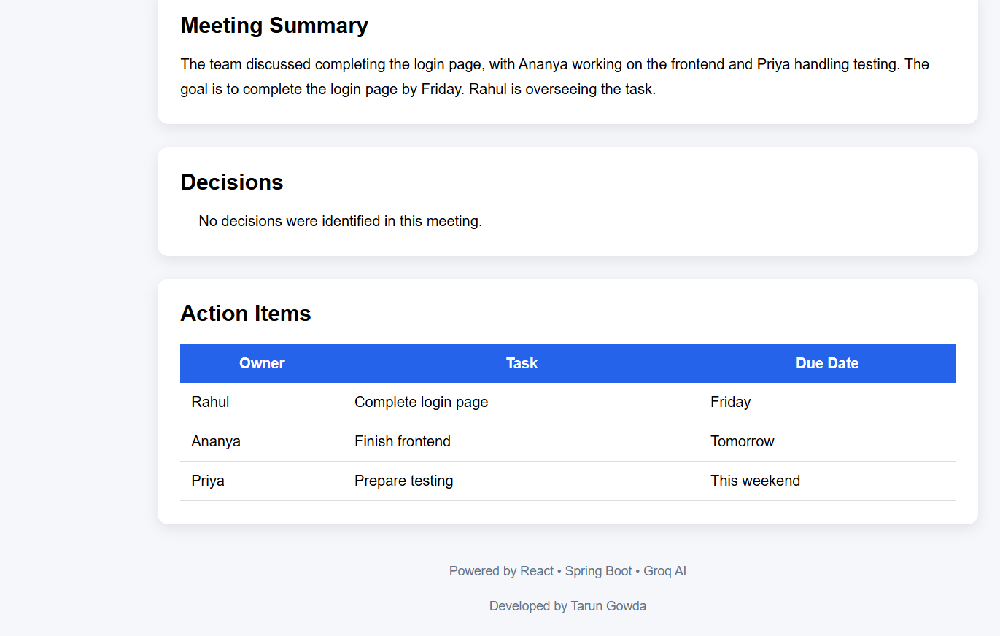

# 🧠 MinuteMind AI

Transform meeting conversations into actionable insights using AI.

MinuteMind AI is a full-stack web application that leverages Groq's Large Language Models (LLMs) to analyze meeting transcripts and automatically generate concise summaries, identify key decisions, and extract actionable tasks.

---

## ✨ Features

- 📄 AI-generated meeting summary
- ✅ Automatic extraction of key decisions
- 📌 Action item identification
- 👤 Detects task owner
- 📅 Extracts due dates
- ⚡ Fast AI-powered analysis using Groq
- 🎨 Clean and responsive React interface
- 🔄 Loading indicator during analysis
- ❌ User-friendly error handling
- 🧹 Clear transcript and results with a single click

---

## 🛠 Tech Stack

### Frontend

- React
- Axios
- CSS3

### Backend

- Spring Boot
- Java 21
- Maven

### AI Integration

- Groq API
- Llama 3.3 70B Versatile

---

## 📂 Project Structure

```
MinuteMind-AI/
│
├── backend/
│
├── frontend/
│
├── screenshots/
│   ├── Home.png
│   ├── Input.png
│   └── Output.png
│
├── README.md
│
└── .gitignore


```

---

## 🚀 Getting Started

### Clone the Repository

```bash
git clone https://github.com/Tarungowda8/MinuteMind-AI.git
```

---

## Backend Setup

Navigate to the backend folder

```bash
cd backend
```

Open `application.properties`

Add your Groq API Key

```properties
groq.api.key=YOUR_GROQ_API_KEY
groq.model=llama-3.3-70b-versatile
```

Run the Spring Boot application

```bash
mvn spring-boot:run
```

Backend runs at

```
http://localhost:9998
```

---

## Frontend Setup

Navigate to the frontend folder

```bash
cd frontend
```

Install dependencies

```bash
npm install
```

Start the React application

```bash
npm run dev
```

Frontend runs at

```
http://localhost:5173
```

> If port 5173 is already in use, Vite may automatically use another available port such as 5174.

---

## 📷 Screenshots

### Home Page




---

### Input Block



---
 
### AI Generated Results



---

## 📁 Sample Files

The project includes sample meeting transcripts and expected outputs for testing.

- `sample_transcripts/`
- `sample_outputs/`

---

## 💡 Future Enhancements

- Export summary as PDF
- Meeting history
- User authentication
- Calendar integration
- Email action items
- Multiple AI model support

---

## 👨‍💻 Author

**Tarun Gowda**

Computer Science Engineering Student

---

## ❤️ Built With

- React
- Spring Boot
- Groq AI
- Java
- Maven

---

## 📜 License

This project is developed for educational and learning purposes.